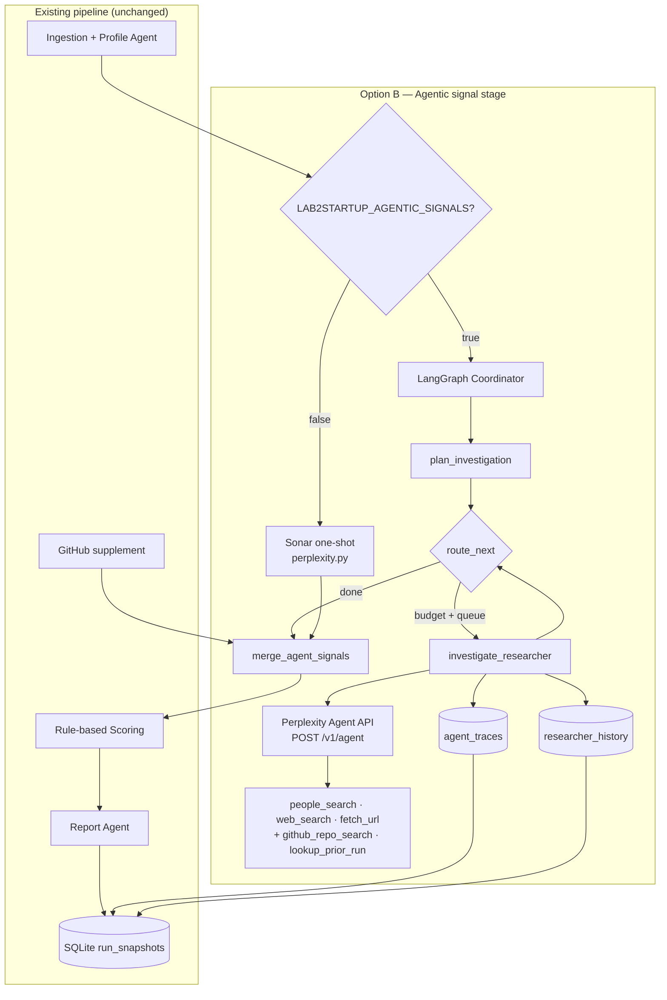
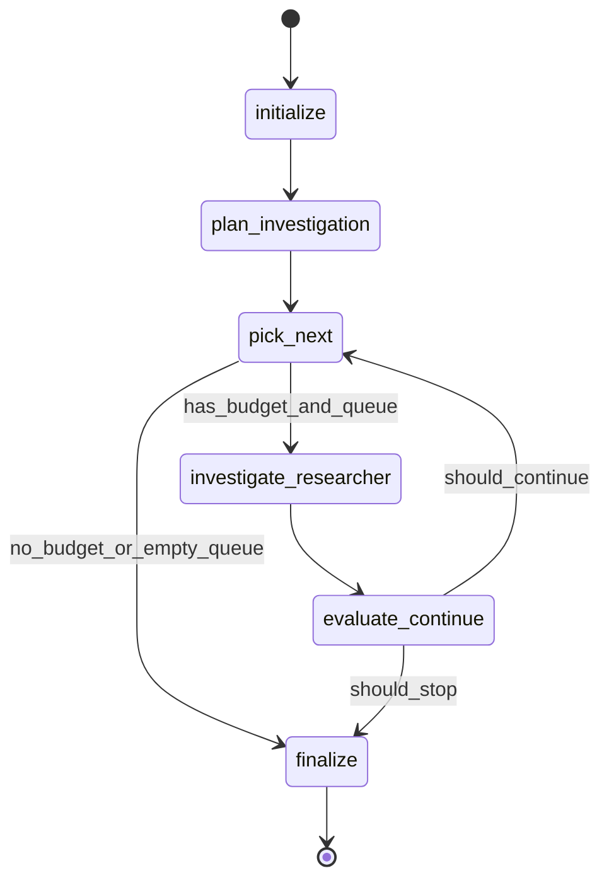
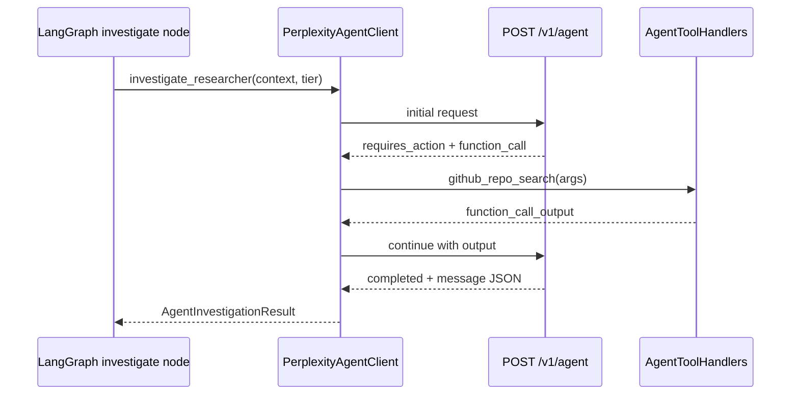

# Lab2Startup — Option B: Agentic Signal Pipeline

**LangGraph coordinator + Perplexity Agent API per investigation node**

Status: **Week 2 implemented** (Week 3 pending)  
Parent roadmap: [PLAN.md](PLAN.md)  
Baseline code: Sonar one-shot in [`app/integrations/perplexity.py`](app/integrations/perplexity.py), linear pipeline in [`app/agents/signal_agent.py`](app/agents/signal_agent.py)

---

## 1. Executive summary & goals

### Problem

The current signal stage is **linear and uniform**: every selected researcher gets one Sonar call (`POST /v1/sonar`) with a fixed prompt, fixed `max_researchers` cap, and no reasoning loop. The coordinator cannot:

- Spend more budget on high-potential candidates and skip low-value ones
- Use multi-step ReAct (search → fetch URL → verify identity → confirm founder evidence)
- Reuse prior-run intelligence from SQLite
- Produce auditable investigation traces for VC review

### Option B solution

Replace the Sonar one-shot path (when enabled) with a **LangGraph state machine** that:

1. **Plans** which researchers to investigate and assigns a **tier** (light / standard / deep) with matching `max_steps` caps
2. **Investigates** each selected researcher via **Perplexity Agent API** (`POST /v1/agent`) with built-in tools (`people_search`, `web_search`, `fetch_url`) plus **custom functions** (`github_repo_search`, `lookup_prior_run`)
3. **Emits** the same `Signal` and `Researcher` models consumed by existing rule-based scoring ([`app/scoring.py`](app/scoring.py)) and report generation
4. **Persists** full agent traces and cross-run researcher history in SQLite

### Goals

| Goal | Success metric |
|------|----------------|
| Real agentic investigation | ≥1 researcher per run shows multi-step tool use in stored trace |
| Tiered cost control | Run stays within configured agent-call and `max_steps` budgets |
| Backward compatibility | Sonar path unchanged when `LAB2STARTUP_AGENTIC_SIGNALS=false` |
| Scoring unchanged | Existing pytest scoring tests pass without modification |
| Auditability | Dashboard can show investigation trace for any agent-derived signal |
| Production-ready | Feature-flagged rollout; failed agent calls degrade gracefully |

### Non-goals (this phase)

- Replacing rule-based scoring with LLM scoring
- Real-time streaming dashboard during investigation
- Multi-agent debate or human-in-the-loop approval mid-run
- Migrating ingestion/profile/clustering to LangGraph (reuse as-is)

---

## 2. Architecture

### High-level flow



### Component responsibilities

| Component | Location (proposed) | Role |
|-----------|-------------------|------|
| Feature flag router | `app/agents/signal_agent.py` | Chooses Sonar vs agentic path |
| LangGraph graph | `app/agents/signal_graph.py` | State machine: plan → investigate → stop |
| Coordinator logic | `app/agents/signal_coordinator.py` | Queue ranking, tier assignment, stop rules |
| Agent API client | `app/integrations/perplexity_agent.py` | `POST /v1/agent`, tool loop, JSON parsing |
| Custom tool handlers | `app/integrations/agent_tools.py` | Execute GitHub + SQLite lookups locally |
| Trace persistence | `app/agent_trace_store.py` | CRUD for `agent_traces`, `researcher_history` |
| Config | `app/config.py` | `AgenticSignalConfig` dataclass + env vars |
| Dashboard | `dashboard/agent_trace_ui.py` | Trace inspection UI |

### Integration seam

The swap happens inside `detect_signals()` after profiles are built:

```python
# app/agents/signal_agent.py (conceptual)
if agentic_config.enabled:
    researchers, signals, traces = run_agentic_signal_graph(...)
elif perplexity_config.enabled:
    researchers, signals = enrich_researchers_with_perplexity(...)
```

Downstream `attach_signals()` → `run_scoring()` → `run_reports()` → `save_run_snapshot()` remain unchanged.

---

## 3. LangGraph state schema

Use a `TypedDict` with `Annotated` reducers where lists accumulate.

```python
# app/agents/signal_graph_state.py

from typing import Annotated, Literal, TypedDict
import operator

InvestigationTier = Literal["skip", "light", "standard", "deep"]
StopReason = Literal[
    "budget_exhausted",
    "queue_empty",
    "early_exit_high_signal",
    "max_researchers_reached",
    "coordinator_stop",
    "error",
]

class AgentTraceRecord(TypedDict):
    trace_id: str
    researcher_id: str
    tier: InvestigationTier
    max_steps: int
    status: Literal["completed", "failed", "skipped"]
    tool_calls_count: int
    steps_used: int
    input_tokens: int
    output_tokens: int
    summary: str
    # Full payloads stored in SQLite, not inlined in graph state

class AgenticSignalState(TypedDict):
    # --- Run context (immutable after init) ---
    run_id: str
    conference: str
    year: int
    fund_context: str | None

    # --- Profile data (from build_profiles) ---
    papers: list  # list[Paper]
    researchers: list  # list[Researcher]
    clusters: list  # list[Cluster]

    # --- Coordinator planning ---
    candidate_scores: dict[str, float]  # researcher_id → prefilter score
    investigation_queue: list[str]  # researcher_ids, highest priority first
    tier_by_researcher: dict[str, InvestigationTier]
    current_researcher_id: str | None

    # --- Budget tracking ---
    max_agent_calls: int
    agent_calls_used: int
    max_total_steps: int  # optional global step cap across all investigations
    steps_used_total: int

    # --- Outputs (accumulators) ---
    signals: Annotated[list, operator.add]
    researcher_updates: dict[str, dict]  # researcher_id → partial profile patch
    traces: Annotated[list[AgentTraceRecord], operator.add]
    errors: Annotated[list[str], operator.add]

    # --- Control ---
    stop_reason: StopReason | None
    should_continue: bool
```

### Prefilter score inputs (coordinator, no LLM required)

Compute a deterministic `candidate_scores` before any Agent API call:

| Factor | Weight | Source |
|--------|--------|--------|
| Paper count | 0–25 | `len(researcher.papers)` |
| Applied topic match | 0–25 | fund `topic_scores` + paper topics |
| Recency | 0–15 | latest paper year |
| Coauthor network | 0–10 | `len(researcher.coauthors)` |
| Prior signals (history) | 0–15 | `researcher_history.last_signal_count` |
| Identity confidence penalty | −10 to 0 | `IdentityConfidence` enum |
| Already investigated this run | skip | `investigated_ids` |

This mirrors existing Sonar selection (`_target_researchers_for_perplexity`: sort by paper count) but adds fund-aware ranking and history.

---

## 4. Graph nodes, edges & conditional routing

### Node definitions

| Node | Input | Output | Notes |
|------|-------|--------|-------|
| `initialize` | papers, researchers, clusters, config | `candidate_scores`, empty queue | Idempotent; skips if queue preloaded (tests) |
| `plan_investigation` | scores, config, history | `investigation_queue`, `tier_by_researcher` | Assigns tiers; respects `max_agent_calls` |
| `pick_next` | queue, `agent_calls_used` | `current_researcher_id`, pop queue | No-op if budget exhausted |
| `investigate_researcher` | current researcher, tier | signals, profile patch, trace | Calls Perplexity Agent API |
| `evaluate_continue` | signals so far, budget, queue | `should_continue`, optional `stop_reason` | Flexible stop (see §4.2) |
| `finalize` | all signals, updates | merged researchers | Apply profile patches; dedupe URLs |

### Edge map



### Conditional routing functions

```python
def route_after_pick(state: AgenticSignalState) -> Literal["investigate_researcher", "finalize"]:
    if state["agent_calls_used"] >= state["max_agent_calls"]:
        return "finalize"
    if not state["investigation_queue"]:
        return "finalize"
    if state["current_researcher_id"] is None:
        return "finalize"
    return "investigate_researcher"

def route_after_evaluate(state: AgenticSignalState) -> Literal["pick_next", "finalize"]:
    return "pick_next" if state["should_continue"] else "finalize"
```

### 4.1 Tier assignment (coordinator rules)

| Tier | When | `max_steps` | Preset override | Est. cost |
|------|------|-------------|-----------------|-----------|
| `skip` | Below prefilter threshold OR identity `low` | 0 | — | $0 |
| `light` | Rank 11–15, or medium identity | 1 | `fast-search` | ~$0.01–0.03 |
| `standard` | Rank 4–10, default | 3 | `pro-search` | ~$0.05–0.15 |
| `deep` | Rank 1–3, or prior confirmed founder | 6–10 | `deep-research` (cap at 8) | ~$0.15–0.40 |

Default queue size: **top 15** prefiltered researchers; default **10 agent calls** per run (same as current `LAB2STARTUP_PERPLEXITY_MAX_RESEARCHERS`).

### 4.2 Flexible stop conditions (`evaluate_continue`)

Continue investigating while **all** of the following hold:

1. `agent_calls_used < max_agent_calls`
2. `investigation_queue` non-empty
3. `steps_used_total < max_total_steps` (optional global cap, default 40)
4. No **early exit** triggered

**Early exit** (stop remaining queue) when any of:

- `confirmed_founder` signal with `evidence_strength=high` found (configurable: `LAB2STARTUP_AGENTIC_EARLY_EXIT=true`)
- ≥3 researchers already have `possible_founder` or better at medium+ strength
- Coordinator explicit stop (future: LLM planner node — Week 2 optional)

This satisfies the "flexible stop condition" preference without unbounded spend.

---

## 5. Perplexity Agent API integration

### 5.1 Client design (`app/integrations/perplexity_agent.py`)

Separate from existing `PerplexityClient` (Sonar). Reuse:

- `PERPLEXITY_API_BASE`, auth headers, `_extract_json_object`
- `SIGNAL_RESPONSE_SCHEMA`, `parse_perplexity_profile`, `parse_perplexity_signals`
- `build_researcher_context`, `build_founder_search_prompt` (adapt for agent `input`)

New class: `PerplexityAgentClient`

```python
@dataclass
class AgentInvestigationConfig:
    model: str = "openai/gpt-5.1"  # or preset name
    preset: str | None = "pro-search"  # overridden by tier
    max_steps: int = 3
    timeout: float = 180.0
    response_format: dict  # reuse SIGNAL_RESPONSE_SCHEMA

class PerplexityAgentClient:
    def investigate_researcher(
        self,
        context: dict,
        *,
        tier: InvestigationTier,
        config: AgentInvestigationConfig,
        tool_handlers: AgentToolHandlers,
    ) -> AgentInvestigationResult:
        ...
```

### 5.2 Request shape

```json
{
  "preset": "pro-search",
  "max_steps": 3,
  "input": "<founder investigation prompt with researcher context>",
  "instructions": "You are a VC sourcing analyst. Resolve identity first, then search for founder evidence. Use lookup_prior_run before web search when available. Return JSON matching the schema in your final message.",
  "tools": [
    {"type": "people_search"},
    {"type": "web_search", "filters": {"search_recency_filter": "year"}},
    {"type": "fetch_url", "max_urls": 3},
    {
      "type": "function",
      "name": "github_repo_search",
      "description": "Search GitHub for repos linked to this researcher's papers or name",
      "parameters": {
        "type": "object",
        "properties": {
          "query": {"type": "string"},
          "min_stars": {"type": "integer"}
        },
        "required": ["query"]
      },
      "strict": true
    },
    {
      "type": "function",
      "name": "lookup_prior_run",
      "description": "Fetch prior Lab2Startup investigation results for this researcher from SQLite",
      "parameters": {
        "type": "object",
        "properties": {
          "researcher_name": {"type": "string"},
          "researcher_id": {"type": "string"}
        },
        "required": ["researcher_name"]
      },
      "strict": true
    }
  ],
  "response_format": {
    "type": "json_schema",
    "json_schema": {
      "name": "researcher_intel",
      "schema": { "...": "SIGNAL_RESPONSE_SCHEMA" }
    }
  }
}
```

Tier → request mapping:

| Tier | `preset` | `max_steps` | `web_search.search_context_size` |
|------|----------|-------------|----------------------------------|
| light | `fast-search` | 1 | `low` |
| standard | `pro-search` | 3 | `medium` |
| deep | `deep-research` | 8 | `high` |

### 5.3 Custom function execution loop

Perplexity returns `status: requires_action` with `function_call` output items for custom tools. Implement a **local tool loop** (max 3 round-trips per investigation):



`AgentToolHandlers` wraps:

- `github_repo_search` → thin wrapper over [`app/integrations/github.py`](app/integrations/github.py) search helpers
- `lookup_prior_run` → query `researcher_history` + latest `agent_traces` for same `researcher_id`

Built-in tools (`people_search`, `web_search`, `fetch_url`) execute server-side — no local loop.

### 5.4 JSON output schema

**Reuse existing `SIGNAL_RESPONSE_SCHEMA`** from [`app/integrations/perplexity.py`](app/integrations/perplexity.py) (lines 31–88) for final structured output. Extend with optional investigation metadata stored in trace only (not in `Signal` model):

```python
AGENT_TRACE_METADATA_SCHEMA = {
    "type": "object",
    "properties": {
        "investigation_summary": {"type": "string"},
        "identity_resolution_steps": {"type": "array", "items": {"type": "string"}},
        "sources_consulted": {"type": "array", "items": {"type": "string"}},
        "confidence_rationale": {"type": "string"},
    },
}
```

Parse path:

1. Extract final message content → `_extract_json_object`
2. `parse_perplexity_profile()` → researcher patch
3. `parse_perplexity_signals()` → `list[Signal]` with IDs prefixed `agent_{slug}_{n}` (distinct from `perplexity_`)
4. Store raw `response` JSON + reasoning events in `agent_traces`

### 5.5 Error handling

| Failure | Behavior |
|---------|----------|
| HTTP 429/5xx | Retry 2× with exponential backoff; then mark trace `failed`, continue queue |
| Invalid JSON | Trace `failed`; no signals for that researcher |
| `requires_action` loop > 3 | Submit best-effort partial; trace `failed` |
| Timeout | Cancel; trace `failed`; decrement effective budget |
| Missing API key | Raise at graph entry if agentic enabled (same as Sonar) |

---

## 6. SQLite schema additions

Extend [`app/database.py`](app/database.py) `SCHEMA_SQL` with migration-safe `CREATE TABLE IF NOT EXISTS`.

### 6.1 `agent_traces`

Stores one row per Perplexity Agent investigation.

```sql
CREATE TABLE IF NOT EXISTS agent_traces (
    id TEXT PRIMARY KEY,
    run_id TEXT NOT NULL,
    researcher_id TEXT NOT NULL,
    researcher_name TEXT NOT NULL,
    tier TEXT NOT NULL,                    -- skip|light|standard|deep
    max_steps INTEGER NOT NULL,
    steps_used INTEGER,
    preset TEXT,
    model TEXT,
    status TEXT NOT NULL,                  -- completed|failed|skipped
    tool_calls_count INTEGER DEFAULT 0,
    input_tokens INTEGER,
    output_tokens INTEGER,
    estimated_cost_usd REAL,
    summary TEXT,                          -- human-readable investigation summary
    request_json TEXT,                     -- redacted API key
    response_json TEXT,                    -- full Agent API response
    signals_emitted INTEGER DEFAULT 0,
    error_message TEXT,
    created_at TEXT NOT NULL,
    FOREIGN KEY (run_id) REFERENCES pipeline_runs(id)
);

CREATE INDEX IF NOT EXISTS idx_agent_traces_run_id ON agent_traces(run_id);
CREATE INDEX IF NOT EXISTS idx_agent_traces_researcher_id ON agent_traces(researcher_id);
```

### 6.2 `researcher_history`

Cross-run memory for coordinator + `lookup_prior_run` tool.

```sql
CREATE TABLE IF NOT EXISTS researcher_history (
    researcher_id TEXT PRIMARY KEY,
    canonical_name TEXT NOT NULL,
    last_run_id TEXT,
    last_investigated_at TEXT,
    last_conference TEXT,
    last_year INTEGER,
    last_tier TEXT,
    last_signal_count INTEGER DEFAULT 0,
    last_best_signal_type TEXT,            -- confirmed_founder|possible_founder|...
    last_identity_confidence TEXT,
    affiliation TEXT,
    profile_url TEXT,
    notes_json TEXT,                       -- optional: prior signal URLs, trace_id refs
    updated_at TEXT NOT NULL,
    FOREIGN KEY (last_run_id) REFERENCES pipeline_runs(id)
);

CREATE INDEX IF NOT EXISTS idx_researcher_history_name ON researcher_history(canonical_name);
```

### 6.3 Run config metadata

Add to `pipeline_runs.config_json.integrations`:

```json
{
  "agentic_signals": {
    "enabled": true,
    "max_agent_calls": 10,
    "max_total_steps": 40,
    "early_exit": true
  }
}
```

### 6.4 New module: `app/agent_trace_store.py`

| Function | Purpose |
|----------|---------|
| `save_agent_trace(trace: AgentTraceRow)` | Insert trace after each investigation |
| `list_traces_for_run(run_id)` | Dashboard + API |
| `get_trace(trace_id)` | Detail view |
| `upsert_researcher_history(...)` | After successful investigation |
| `lookup_researcher_history(researcher_id \| name)` | Coordinator + custom tool |
| `summarize_run_traces(run_id)` | Cost/token aggregates for dashboard |

Hook `save_agent_trace` + `upsert_researcher_history` from `investigate_researcher` node; hook trace listing from `run_service.execute_pipeline_run` completion log.

---

## 7. Phased implementation

### Week 1 — Foundation (vertical slice)

**Objective:** One end-to-end agentic run works behind feature flag; traces persisted; scoring unchanged.

| # | Task | Files | Est. |
|---|------|-------|------|
| W1-1 | Add dependencies: `langgraph`, `langchain-core` (minimal — graph only) | `requirements.txt`, `pyproject.toml` if present | 0.5h |
| W1-2 | `AgenticSignalConfig` + env parsing | `app/config.py`, `.env.example` | 1h |
| W1-3 | SQLite schema + `agent_trace_store.py` | `app/database.py`, `app/agent_trace_store.py` | 2h |
| W1-4 | `PerplexityAgentClient` — single-shot agent call, no custom functions yet | `app/integrations/perplexity_agent.py` | 4h |
| W1-5 | `AgenticSignalState` + graph skeleton (initialize → plan → investigate → finalize) | `app/agents/signal_graph_state.py`, `app/agents/signal_graph.py` | 4h |
| W1-6 | Deterministic coordinator (prefilter scores + tier assignment) | `app/agents/signal_coordinator.py` | 3h |
| W1-7 | Wire into `detect_signals()` behind flag | `app/agents/signal_agent.py` | 1h |
| W1-8 | Persist traces on run complete | `app/run_service.py` | 1h |
| W1-9 | Unit tests: coordinator ranking, JSON parse, trace store | `tests/test_signal_coordinator.py`, `tests/test_agent_trace_store.py`, `tests/test_perplexity_agent.py` | 4h |
| W1-10 | Integration test: mock Agent API, full graph → signals → scores | `tests/test_agentic_signal_graph.py` | 3h |

**Week 1 file touch list**

```
requirements.txt
.env.example
app/config.py
app/database.py
app/agent_trace_store.py
app/integrations/perplexity_agent.py
app/agents/signal_graph_state.py
app/agents/signal_graph.py
app/agents/signal_coordinator.py
app/agents/signal_agent.py
app/run_service.py
tests/test_signal_coordinator.py
tests/test_agent_trace_store.py
tests/test_perplexity_agent.py
tests/test_agentic_signal_graph.py
tests/conftest.py          # fixtures: mock agent response, temp DB
```

### Week 2 — Production hardening + observability

**Objective:** Custom tools, dashboard traces, tiered budgets tuned, demo-ready.

| # | Task | Files | Est. |
|---|------|-------|------|
| W2-1 | Custom tool handlers + `requires_action` loop | `app/integrations/agent_tools.py`, extend `perplexity_agent.py` | 5h |
| W2-2 | `lookup_prior_run` + history upsert after each investigation | `app/agent_trace_store.py`, `agent_tools.py` | 2h |
| W2-3 | GitHub function tool (reuse github integration) | `app/integrations/agent_tools.py` | 2h |
| W2-4 | Flexible stop conditions + early exit | `app/agents/signal_coordinator.py`, `signal_graph.py` | 2h |
| W2-5 | Dashboard: trace list + detail expander on candidate page | `dashboard/agent_trace_ui.py`, `dashboard/streamlit_app.py` | 4h |
| W2-6 | Sidebar: show "Agentic signals" vs "Sonar" mode | `dashboard/streamlit_app.py` | 1h |
| W2-7 | CLI probe command: `python -m app.integrations.perplexity_agent --name "..."` | `app/integrations/perplexity_agent.py` | 1h |
| W2-8 | Cost summary in run metadata + dashboard metric | `app/run_service.py`, `dashboard/streamlit_app.py` | 2h |
| W2-9 | README + PLAN.md cross-links | `README.md`, `PLAN.md` | 1h |
| W2-10 | Live smoke test script + recorded VCR fixtures | `tests/fixtures/agent_responses/`, `tests/test_agentic_live.py` (skipped in CI) | 3h |

**Week 2 file touch list**

```
app/integrations/agent_tools.py
app/integrations/perplexity_agent.py
app/agents/signal_coordinator.py
app/agents/signal_graph.py
app/agent_trace_store.py
dashboard/agent_trace_ui.py
dashboard/streamlit_app.py
dashboard/scoring_ui.py       # badge: agent vs sonar signal source
app/run_service.py
README.md
PLAN.md
tests/test_agent_tools.py
tests/test_agentic_signal_graph.py
tests/fixtures/agent_responses/*.json
```

---

## 8. Backward compatibility

### Feature flag

```bash
LAB2STARTUP_AGENTIC_SIGNALS=false   # default — existing Sonar path
LAB2STARTUP_AGENTIC_SIGNALS=true    # Option B LangGraph path
```

### Behavior matrix

| Setting | Signal path | Traces | Scoring | Dashboard |
|---------|-------------|--------|---------|-----------|
| `AGENTIC=false`, `PERPLEXITY=true` | Sonar `/v1/sonar` (current) | None | Unchanged | Current UI |
| `AGENTIC=true`, `PERPLEXITY=true` | LangGraph + Agent API | `agent_traces` populated | Unchanged | + trace tab |
| `AGENTIC=true`, `PERPLEXITY=false` | Graph runs but no API key → error at start | — | — | Error in sidebar |
| `AGENTIC=false`, `PERPLEXITY=false` | Mock JSON + GitHub only | None | Unchanged | Current UI |

### Compatibility rules

1. **Do not remove** `PerplexityClient`, `enrich_researchers_with_perplexity`, or `SIGNAL_RESPONSE_SCHEMA`
2. **Signal IDs:** Sonar → `perplexity_*`; Agent → `agent_*` (dashboard already keys off prefix in `summarize_perplexity_signals` — add parallel helper)
3. **GitHub supplement** stays outside the graph; merged in `detect_signals()` after agentic stage (same as today)
4. **Mock signals** in dev: when `use_mock_signals=true`, merge mock JSON **before** agentic enrichment (agent signals append, dedupe by URL — reuse `merge_perplexity_signals`)
5. **Stored runs:** Old snapshots deserialize unchanged; trace tables simply empty for legacy runs
6. **`config_json`:** Add `agentic_signals` block without breaking existing dashboard run selector

### Env vars (new)

| Variable | Default | Purpose |
|----------|---------|---------|
| `LAB2STARTUP_AGENTIC_SIGNALS` | `false` | Enable Option B |
| `LAB2STARTUP_AGENTIC_MAX_CALLS` | `10` | Max Agent API investigations per run |
| `LAB2STARTUP_AGENTIC_MAX_TOTAL_STEPS` | `40` | Global step budget |
| `LAB2STARTUP_AGENTIC_EARLY_EXIT` | `true` | Stop queue on high-confidence founder |
| `LAB2STARTUP_AGENTIC_DEEP_SLOTS` | `3` | Top N get `deep` tier |
| `LAB2STARTUP_AGENTIC_STANDARD_SLOTS` | `7` | Next N get `standard` tier |
| `LAB2STARTUP_AGENTIC_PREFILTER_MIN_SCORE` | `20` | Skip below this prefilter score |
| `LAB2STARTUP_AGENTIC_MODEL` | — | Override model (else use preset) |
| `LAB2STARTUP_AGENTIC_PRESET_STANDARD` | `pro-search` | Preset for standard tier |
| `LAB2STARTUP_AGENTIC_PRESET_DEEP` | `deep-research` | Preset for deep tier |

When `LAB2STARTUP_AGENTIC_SIGNALS=true`, ignore `LAB2STARTUP_PERPLEXITY_MAX_RESEARCHERS` for call count (use `AGENTIC_MAX_CALLS` instead) but still require `LAB2STARTUP_PERPLEXITY_API_KEY`.

---

## 9. Testing strategy

### Unit tests (CI, no network)

| Test file | Covers |
|-----------|--------|
| `test_signal_coordinator.py` | Prefilter scoring, tier assignment, queue ordering, stop rules |
| `test_agent_trace_store.py` | Schema init, save/list/load traces, history upsert |
| `test_perplexity_agent.py` | Parse fixture responses, `requires_action` loop with mock httpx |
| `test_agent_tools.py` | GitHub + history lookup handlers |
| `test_agentic_signal_graph.py` | Full graph with mocked `PerplexityAgentClient` |

### Integration tests

- **`test_agentic_signal_graph.py`:** Mock JSON papers → graph → `detect_signals(agentic=True)` → `run_scoring()` → assert scores match baseline structure
- **`test_run_store.py`:** Extend to verify traces saved alongside snapshot for agentic run
- **Regression:** Existing `test_scoring.py`, `test_run_store.py` pass with flag off

### Fixtures

```
tests/fixtures/agent_responses/
  standard_completed.json      # status=completed, profile+signals
  deep_with_tool_calls.json    # reasoning events populated
  requires_action_github.json  # function_call → output → completed
  invalid_json.json            # error path
```

Use `httpx.MockTransport` or `pytest-httpx` — same pattern as other integration tests.

### Live / manual tests (not CI)

```bash
export LAB2STARTUP_AGENTIC_SIGNALS=true
export LAB2STARTUP_PERPLEXITY_API_KEY=...
python run_pipeline.py --conference NeurIPS --year 2024
python run_dashboard.py
# Verify: agent traces visible, signals have agent_ prefix, scores populated
```

```bash
# Single-researcher probe
python -m app.integrations.perplexity_agent \
  --name "John Yang" \
  --tier deep
```

---

## 10. Dashboard changes

### 10.1 Sidebar run info

When `config_json.integrations.agentic_signals.enabled`:

- Show badge: **Signal mode: Agentic (LangGraph)**
- Show run totals: `X investigations · Y tokens · ~$Z est.`

### 10.2 New module: `dashboard/agent_trace_ui.py`

| UI element | Location | Content |
|------------|----------|---------|
| `render_run_trace_summary(run_id)` | Explore tab, above candidate select | Table: researcher, tier, steps, tools, status |
| `render_researcher_trace_expander(researcher_id, run_id)` | Candidate detail section | Step timeline, tool calls, sources, raw JSON download |
| Signal source badge | `render_signal_sources_expander` | Label `agent` vs `perplexity` vs `github` vs `mock` |

### 10.3 Trace detail view (expandable)

```
Investigation trace — Jane Doe (deep, 6/8 steps)
├── Step 1: people_search("Jane Doe Stanford AI agents")
├── Step 2: fetch_url(linkedin.com/...)
├── Step 3: web_search("Jane Doe startup founder")
├── Step 4: lookup_prior_run → no prior data
├── Step 5: github_repo_search("SWE-agent") → 2 repos
└── Output: 1× possible_founder (medium), affiliation updated
[Download full JSON]
```

### 10.4 Empty states

- Legacy Sonar runs: "No agent traces (Sonar mode was used for this run)"
- Failed trace: show `error_message` + partial signals if any

---

## 11. Cost & cap defaults

Based on current production defaults (`max_researchers=10`) and Perplexity preset docs:

| Cap | Default | Rationale |
|-----|---------|-----------|
| `AGENTIC_MAX_CALLS` | 10 | Matches `PERPLEXITY_MAX_RESEARCHERS` |
| Deep slots | 3 | Top 3 candidates worth 8 steps each |
| Standard slots | 7 | Remaining budget |
| Light slots | 0 (Week 1) | Add in Week 2 if cost headroom |
| `AGENTIC_MAX_TOTAL_STEPS` | 40 | ~3 deep × 8 + 7 standard × 3 = 45 upper bound; early exit lowers actual |
| Global concurrency | 2 | Lower than Sonar's 3 — agent calls are heavier |
| Request delay | 1.5s | Between investigations |

### Estimated cost per run (NeurIPS-scale)

| Scenario | Calls | Est. cost |
|----------|-------|-----------|
| Conservative (10× standard, 3 steps) | 10 | $0.50–1.50 |
| Default tier mix (3 deep + 7 standard) | 10 | $1.00–3.00 |
| Early exit after 5 researchers | 5 | $0.40–1.50 |

Track actuals via `response.usage` → store in `agent_traces` → aggregate in dashboard.

---

## 12. Interview / demo narrative

Use this 2-minute walkthrough in investor or eng interviews:

> **Problem:** VC associates manually Google every NeurIPS author. Our old pipeline did one search per researcher — no prioritization, no memory, no audit trail.
>
> **Demo flow:**
> 1. Run `python run_pipeline.py --conference NeurIPS --year 2024` with agentic mode on
> 2. Open dashboard → select run → **Top prospects** leaderboard (unchanged scoring)
> 3. Click top candidate → expand **Investigation trace**
> 4. Walk through: "The coordinator ranked 847 researchers, deep-dived the top 3. For this candidate, the agent used people_search to disambiguate, fetch_url on their lab page, found a stealth startup mention, cross-checked GitHub."
> 5. Show **prior run lookup**: "Next month, we skip re-searching known negatives and escalate returning founders."
>
> **Why LangGraph:** Explicit state machine — budget caps, stop conditions, and traces are first-class. Not a black-box chain.
>
> **Why Perplexity Agent API:** Built-in people_search + web_search + fetch_url beats wiring Tavily ourselves; custom functions connect our SQLite history and GitHub data.
>
> **Why keep rule-based scoring:** Transparent, tunable, fund-specific weights in YAML — LLM scores aren't defensible in IC memos yet.

---

## 13. Risks & mitigations

| Risk | Impact | Mitigation |
|------|--------|------------|
| Agent API cost overrun | High | Hard caps on calls + steps; early exit; dashboard cost meter |
| `requires_action` loop complexity | Medium | Cap at 3 round-trips; Week 1 ships without custom functions |
| Identity false positives | High | Keep `identity_confidence` in schema; scoring penalty unchanged; people_search first |
| Latency (10× deep research) | Medium | Tiered investigation; concurrency=2; progress logging in CLI |
| LangGraph dependency weight | Low | Use langgraph only — no full LangChain stack |
| API schema drift | Medium | Pin presets; integration tests with fixtures; monitor Perplexity changelog |
| Trace storage size | Medium | Store compressed JSON; optional `LAB2STARTUP_AGENTIC_STORE_RAW=false` for prod |
| Breaking existing runs | High | Feature flag default off; Sonar path frozen; snapshot format unchanged |

---

## 14. Definition of done

### Week 1 Done

- [x] `LAB2STARTUP_AGENTIC_SIGNALS=true` runs NeurIPS 2024 (or mock) end-to-end
- [x] At least one `agent_traces` row persisted per investigation
- [x] Signals flow into scoring; reports generate identically to Sonar path
- [x] `LAB2STARTUP_AGENTIC_SIGNALS=false` — all existing tests green, zero behavior change
- [x] Coordinator assigns tiers deterministically from prefilter scores
- [x] Mocked CI tests cover graph, trace store, JSON parsing

**Week 2 deferrals (documented):** `LAB2STARTUP_AGENTIC_STORE_RAW` compression, additional VCR fixtures (`deep_with_tool_calls.json`, `invalid_json.json`).

### Week 2 Done

- [x] Custom functions (`github_repo_search`, `lookup_prior_run`) work in live probe
- [x] Dashboard shows trace summary + per-candidate investigation detail
- [x] Early exit stop condition verified with fixture test
- [x] `researcher_history` populated and consumed by second consecutive run
- [x] README documents agentic mode; `.env.example` updated
- [x] Demo script rehearsed; run cost estimate visible in dashboard
- [x] Live smoke test documented (manual, skipped in CI)

**Week 3 deferrals:** Real-time streaming dashboard during investigation, LLM planner node, trace JSON compression.

---

## 15. Quick reference: developer pickup

**Start here:** W1-2 → W1-4 → W1-5 → W1-7 (vertical slice)

**Key existing code to reuse:**

- Signal schema & parsing: [`app/integrations/perplexity.py`](app/integrations/perplexity.py) `SIGNAL_RESPONSE_SCHEMA`, `parse_perplexity_*`
- Signal attachment: [`app/agents/signal_agent.py`](app/agents/signal_agent.py) `attach_signals`, `detect_signals`
- Run persistence: [`app/run_store.py`](app/run_store.py), [`app/run_service.py`](app/run_service.py)
- Scoring (do not modify): [`app/scoring.py`](app/scoring.py)

**Graph entrypoint (target signature):**

```python
def run_agentic_signal_graph(
    *,
    run_id: str,
    papers: list[Paper],
    researchers: list[Researcher],
    clusters: list[Cluster],
    config: AgenticSignalConfig,
    db_path: Path,
) -> tuple[list[Researcher], list[Signal], list[AgentTraceRecord]]:
    ...
```

**Perplexity docs:**

- Agent API: https://docs.perplexity.ai/docs/agent-api/quickstart
- Tools: https://docs.perplexity.ai/docs/agent-api/tools
- Presets / max_steps: https://docs.perplexity.ai/docs/agent-api/presets
