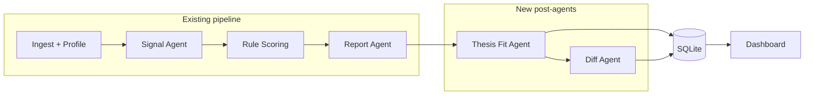

# Lab2Startup — Diff Agent & Thesis Fit Agent

**Autonomous post-pipeline agents for Backtrace Capital**

Status: **Planned**  
Parent roadmap: [PLAN.md](PLAN.md)  
Depends on: stored runs ([Step 11](PLAN.md)), fund profiles ([Step 15](PLAN.md)), agentic signals ([PLAN_AGENTIC.md](PLAN_AGENTIC.md))

---

## 1. Executive summary

### Problem

The pipeline answers: *“Who at this conference might be founding something?”*  
Backtrace also needs:

1. **What changed since we last looked?** (new founders, score moves, new signals)
2. **Should Backtrace care?** (European nexus + infrastructure layer, not apps/biotech)

Today, region is display-only (`infer_region_hint`), thesis fit is implicit in topic scores, and there is no run-to-run comparison or scheduled digest.

### Solution

Two **post-scoring agents** that run automatically at the end of each pipeline run (and optionally on a schedule):

| Agent | LLM? | Role |
|-------|------|------|
| **Diff Agent** | No | Compare run N vs prior run for same conference+year+fund |
| **Thesis Fit Agent** | Rules + optional Sonar | Score Backtrace-specific fit (EU + infra layer) |

Neither replaces the signal agent or rule-based scoring. They add a **fund lens** and **temporal memory**.

### Goals

| Goal | Success metric |
|------|----------------|
| Diff without API cost | Full diff computed from SQLite snapshots in &lt;5s for typical runs |
| Actionable deltas | Dashboard shows “new Take meeting”, “new signals”, “score +15” |
| Thesis fit auditable | Every candidate has `strong \| moderate \| weak \| unclear` + reason bullets |
| Cost control | Sonar thesis calls only on `unclear` or score ≥ threshold (default 60) |
| Autonomous | Runs at end of `execute_pipeline_run` + optional cron CLI |
| Backtrace-first | Config lives in `funds/backtrace.yaml`; other funds can opt in |

### Non-goals (this phase)

- Replacing startup likelihood scoring with LLM scores
- Agent API multi-step loops for thesis fit (Sonar one-shot only)
- Email/Slack delivery (digest JSON + dashboard first; notifications later)
- Cross-conference deduplication of researchers (same person in NeurIPS + ICML)

---

## 2. Architecture

### Pipeline placement



### Autonomous triggers

1. **Inline (default):** `execute_pipeline_run()` → after `save_run_snapshot()` → thesis fit → diff vs prior complete run
2. **Scheduled (optional):** `python run_monitor.py --fund backtrace --priority high` (batch all conferences, then aggregate diff digest)
3. **Manual:** `python run_diff.py --run-id …` / `python run_thesis_fit.py --run-id …`

---

## 3. Diff Agent (Step 16)

### Purpose

Answer: *“What’s new compared to our last run for this conference?”*

### Inputs

- **Current run:** `run_id` N — load via `load_run_result(run_id)`
- **Prior run:** latest **complete** run with same `(conference, year, fund_profile, paper_source)` and `created_at < N`, excluding empty runs — reuse pattern from `find_latest_run_with_papers()` but compare snapshots, not papers only

### Outputs — `RunDiff` model

```python
@dataclass
class ResearcherDelta:
    researcher_id: str
    name: str
    change_type: Literal[
        "new_researcher",
        "removed_researcher",      # optional, low priority
        "score_increased",
        "score_decreased",
        "recommendation_changed",
        "new_signal",
        "signal_removed",
        "affiliation_changed",
        "role_changed",
    ]
    before: str | int | None
    after: str | int | None
    detail: str  # human-readable one-liner

@dataclass
class RunDiff:
    run_id: str
    prior_run_id: str | None
    conference: str
    year: int
    fund_profile: str | None
    computed_at: datetime
    deltas: list[ResearcherDelta]
    summary: RunDiffSummary  # counts by change_type, new take_meeting count, etc.
```

### Diff rules (deterministic)

| Check | Logic |
|-------|--------|
| New researcher | `researcher_id` in N not in N−1 |
| Score change | Δ ≥ 5 points (configurable) on `startup_likelihood_score` |
| Recommendation change | `VCAction` enum differs |
| New signal | `source_url` in N signals not in N−1 for same researcher |
| Affiliation / role | string compare on `Researcher` snapshot fields |
| New “Take meeting” | recommendation became `TAKE_MEETING` |

**Ignore:** noise below score threshold (e.g. ±4 points), `NO_SIGNAL` churn.

### Storage

New table `run_diffs`:

```sql
CREATE TABLE run_diffs (
    run_id TEXT PRIMARY KEY,
    prior_run_id TEXT,
    diff_json TEXT NOT NULL,
    created_at TEXT NOT NULL,
    FOREIGN KEY (run_id) REFERENCES pipeline_runs(id)
);
```

No LLM. Serialize `RunDiff` as JSON (same pattern as `run_snapshots`).

### Files (proposed)

| File | Role |
|------|------|
| `app/agents/diff_agent.py` | `compute_run_diff(current, prior) -> RunDiff` |
| `app/run_diff_store.py` | save/load diff by run_id |
| `run_diff.py` | CLI: compute diff for existing run |
| `tests/test_diff_agent.py` | Fixture runs N/N−1 |

### Dashboard (Step 16 UI)

- Tab or expander: **“Changes since last run”** on main view when `active_run` has a diff
- Highlights: new Take meeting, new signals, top score jumps
- Link each delta → Explore tab (`selected_report_id`)

---

## 4. Thesis Fit Agent (Step 17)

### Purpose

Answer: *“Should Backtrace Capital care about this person?”* — European nexus + infrastructure layer.

Distinct from signal agent (*“Are they a founder?”*).

### Outputs — `ThesisFitResult` model

```python
class ThesisFitLevel(str, Enum):
    STRONG = "strong"
    MODERATE = "moderate"
    WEAK = "weak"
    UNCLEAR = "unclear"

class ThesisFitAssessment(BaseModel):
    researcher_id: str
    fund_id: str  # e.g. backtrace
    infra_layer: Literal["infra", "application", "mixed", "unclear"]
    europe_nexus: Literal["yes", "no", "unclear"]
    fit_level: ThesisFitLevel
    reasons: list[str]  # audit bullets
    source: Literal["rules", "sonar", "rules+sonar"]
    sonar_used: bool = False
```

Stored per run in `run_thesis_fit` table (JSON blob keyed by `run_id`, or per-researcher rows if we need querying later).

### Phase A — Rule pass (every scored researcher)

Extend `funds/backtrace.yaml`:

```yaml
thesis_fit:
  europe_regions:
    - Germany
    - United Kingdom
    - Switzerland
    # ... EU + EEA + UK + CH
  infra_keywords:
    - platform engineering
    - developer tools
    - distributed systems
    - MLOps
    - secure compute
    - observability
  application_keywords:  # soft negative
    - consulting
    - legal tech
    - consumer
  hard_exclude_keywords:  # inherit exclude_topic_keywords
    - drug discovery
    - biotech
```

Rule logic in `app/thesis_fit_rules.py`:

1. **Europe score:** `infer_region_hint(affiliation)` ∈ europe_regions → `yes`; US-only with no EU signal → `no`; else `unclear`
2. **Infra score:** paper topics + signal descriptions vs keyword lists; biotech exclude → `weak`
3. **Combine:** matrix → `fit_level` + `reasons[]`

If `fit_level` is `strong` or `weak` with high confidence → **stop** (no API).

### Phase B — Sonar pass (subset only)

Trigger when:

- `fit_level == unclear`, OR
- `startup_likelihood_score >= LAB2STARTUP_THESIS_SONAR_MIN_SCORE` (default 60), OR
- `recommendation == TAKE_MEETING`

One **Sonar** call (`POST /v1/sonar`, not Agent API) with:

- `perplexity_context` from fund YAML
- Researcher name, affiliation, papers, **existing signals** (do not re-investigate founder status)
- Prompt: structured JSON — `infra_layer`, `europe_nexus`, `fit_level`, `reasons`

Reuse `parse_perplexity_*` patterns + `identity_validation` (reject wrong-person prose).

Cap: `LAB2STARTUP_THESIS_SONAR_MAX_CALLS` (default 30/run).

### Files (proposed)

| File | Role |
|------|------|
| `app/agents/thesis_fit_agent.py` | Orchestrator: rules → optional Sonar → merge |
| `app/thesis_fit_rules.py` | Deterministic assessment |
| `app/thesis_fit_store.py` | Persist assessments per run |
| `run_thesis_fit.py` | CLI backfill for existing runs |
| `tests/test_thesis_fit_rules.py` | EU/infra/exclude cases |
| `tests/test_thesis_fit_agent.py` | Mock Sonar fixtures |

### Scoring interaction

**Do not change** `startup_likelihood_score` in v1.  
Display thesis fit as a **separate badge** and optional dashboard filter (“Show Backtrace strong/moderate only”).

Optional v2: small score adjustment (+5 strong EU infra) — defer until validated.

---

## 5. Fund profile extensions

Add to `FundProfile` dataclass (`app/fund_profiles.py`):

```python
@dataclass(frozen=True)
class ThesisFitConfig:
    europe_regions: tuple[str, ...]
    infra_keywords: tuple[str, ...]
    application_keywords: tuple[str, ...]
    sonar_min_score: int = 60
    sonar_max_calls: int = 30

# FundProfile.thesis_fit: ThesisFitConfig | None
```

Load from `funds/backtrace.yaml` under `thesis_fit:` block.

---

## 6. Orchestration

### `execute_pipeline_run()` changes

After `save_run_snapshot()`:

```python
if settings.thesis_fit_enabled and fund:
    thesis_results = run_thesis_fit_agent(result, fund=fund, config=...)
    save_thesis_fit(run_id, thesis_results)

prior = find_prior_complete_run(conference, year, fund_profile, exclude_run_id=run_id)
diff = compute_run_diff(result, prior_result, prior_run_id=prior.id if prior else None)
save_run_diff(run_id, diff)
```

Feature flags:

| Env | Default | Meaning |
|-----|---------|---------|
| `LAB2STARTUP_THESIS_FIT_ENABLED` | `true` | Run thesis fit after pipeline |
| `LAB2STARTUP_DIFF_ENABLED` | `true` | Run diff after pipeline |
| `LAB2STARTUP_THESIS_SONAR_MIN_SCORE` | `60` | Sonar gate |
| `LAB2STARTUP_THESIS_SONAR_MAX_CALLS` | `30` | Cap Sonar thesis calls |

### Scheduled monitor CLI (`run_monitor.py`)

```bash
# Monthly: all high-priority Backtrace conferences
python run_monitor.py --fund backtrace --priority high --year 2025

# Output: runs pipeline (paper reuse), aggregates cross-conference digest
python run_monitor.py --digest-only --since 2026-05-01
```

Uses existing `execute_batch_pipeline_runs` + paper reuse. Digest = roll-up of per-run diffs (no LLM).

---

## 7. Dashboard UX

### Main additions

1. **Badges on researcher cards / table**
   - `Backtrace fit: Strong` (green) / Moderate / Weak / Unclear
   - `EU: Yes` / No / Unknown
   - `Layer: Infra` / App / Mixed

2. **“Changes since last run” panel** (default visible, not dev-tools)
   - Summary counts + table of `ResearcherDelta`
   - Empty state: “First run for this conference — no prior comparison”

3. **Sidebar filters**
   - Backtrace fit: All / Strong+Moderate / Strong only
   - Europe nexus: All / Yes / Unknown

4. **Developer tools** (existing toggle)
   - Raw thesis fit JSON, Sonar request/response if stored

---

## 8. Implementation phases

### Phase 1 — Diff Agent (1–2 days)

- [ ] `RunDiff` / `ResearcherDelta` models
- [ ] `find_prior_complete_run()` in `run_store.py`
- [ ] `diff_agent.py` + tests with two seeded snapshots
- [ ] `run_diffs` table + store
- [ ] Wire into `run_service.py`
- [ ] Dashboard “Changes since last run” panel

### Phase 2 — Thesis Fit rules (1–2 days)

- [ ] Extend `backtrace.yaml` + `FundProfile`
- [ ] `thesis_fit_rules.py` + tests (EU, infra, biotech exclude)
- [ ] `thesis_fit_agent.py` rules-only path
- [ ] `run_thesis_fit` storage
- [ ] Dashboard badges + filter

### Phase 3 — Thesis Fit Sonar gate (1 day)

- [ ] Sonar prompt + JSON schema in `perplexity.py` (or `thesis_fit_sonar.py`)
- [ ] Cap + identity validation on responses
- [ ] Tests with fixtures
- [ ] Cost logging in enrichment audit or new `thesis_fit_audit`

### Phase 4 — Autonomous monitor (1 day)

- [ ] `run_monitor.py` CLI
- [ ] Optional digest markdown export
- [ ] README + `.env.example` updates
- [ ] Document cron example for monthly runs

### Phase 5 — Polish

- [ ] Cross-run researcher dedup (optional)
- [ ] Email/Slack digest hook (optional)
- [ ] v2 score boost for strong EU infra (optional)

---

## 9. Testing strategy

| Area | Tests |
|------|--------|
| Diff | Two runs same conference: new researcher, score +10, new signal URL |
| Diff | First run → `prior_run_id=None`, empty deltas |
| Thesis rules | Munich affiliation + ML systems paper → strong/moderate |
| Thesis rules | Stanford + biotech signal → weak |
| Thesis Sonar | Mock `/v1/sonar` response merged with rules |
| Integration | Full pipeline run produces diff + thesis_fit rows in DB |

---

## 10. Cost estimate (Thesis Fit Sonar)

Per conference run, ~78 researchers, ~15–30 Sonar calls after gating:

- ~$0.01–0.05 per Sonar call → **~$0.15–1.50/run**
- Diff agent: **$0**

Batch 15 conferences/month with reuse: thesis Sonar cost scales with candidates above threshold, not paper count.

---

## 11. Open questions (decide during implementation)

1. **Prior run selection:** Same conference+year only, or also compare to “last month” across reruns?
   - **Recommendation:** same `(conference, year, fund_profile)` latest complete run before current `created_at`.

2. **Removed researchers:** Show in diff or ignore?
   - **Recommendation:** ignore in v1 (focus on new positives).

3. **Thesis fit on clusters:** Defer to v2; researchers only in v1.

4. **Store Sonar raw response:** Yes, in `thesis_fit_audit` for debugging (like agent traces lite).

---

## 12. Related docs

- [PLAN.md](PLAN.md) — Steps 16–17 on roadmap
- [PLAN_AGENTIC.md](PLAN_AGENTIC.md) — Signal investigation (upstream)
- [funds/backtrace.yaml](funds/backtrace.yaml) — Thesis config extension point
- [Backtrace Capital](https://backtrace.vc/) — Investment thesis reference
