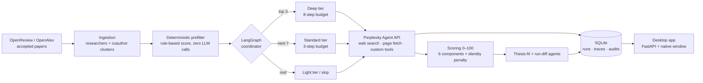

# Lab2Startup

[](https://github.com/rocky2397/lab2startup/actions/workflows/ci.yml)

**Agentic VC sourcing: find academic AI researchers who are about to found startups — before they announce anything.**

Deep-tech founders usually publish before they incorporate. Lab2Startup watches top AI/systems conferences (NeurIPS, ICML, OSDI, USENIX Security, …), builds researcher and coauthor-team profiles from accepted papers, sends AI agents to search the public web for founder and commercialization evidence, and ranks everyone 0–100 by startup likelihood — so a fund's monthly sourcing pass takes minutes instead of days.

## What a run produces

For one conference, one command produces:

- A **ranked candidate list** with a 6-component score breakdown, priority band, and a concrete VC action (take meeting / monitor monthly / watchlist / ignore)
- **Founder signals with evidence**: every claim links to a public source URL, typed (confirmed founder / possible founder / commercialization) and graded by strength
- **Thesis-fit assessment** per researcher against the fund's investment thesis (infra vs application layer, Europe nexus)
- A **diff vs the previous run** of the same conference: new take-meetings, new researchers, score jumps, new signals
- **Full audit trail**: per-researcher investigation traces with step timelines, token counts, and estimated cost, persisted in SQLite

## Measured results

Evaluated against a [golden set](evals/README.md) of 24 NeurIPS authors (2016–2023 papers) with independently verified ground truth: 14 founders (Mistral-famous down to low-publicity foundings) and 10 non-founders. The pipeline gets only what a conference exposes — name, affiliation, paper title.

| Signal mode | Precision | Recall | False positives | Cost | Notes |
|---|---|---|---|---|---|
| One-shot Sonar | **1.000** | 0.571 | **0 / 10** | ~$0.80 (est.) | 24 queries, ~2.5 min |
| Agentic (LangGraph + Agent API) | **1.000** | **1.000** | **0 / 10** | **$0.64 (measured)** | 24 investigations (3 deep / 7 standard / 14 light), 63 tool calls, 357k tokens, 44 min |

What the numbers hide ([full per-researcher tables](evals/results/)):

- **Zero false positives in both modes**, including deliberate hard negatives: researchers who *work at* AI companies without having founded them, and — the strongest case — a professor the agent caught being named "founding advisor" of a stealth startup and correctly classified as commercialization evidence, not a founding.
- **The agentic tier earns its keep on the hard half.** One-shot Sonar found the famous founders plus two obscure ones, but missed five (its query anchors on the researcher's big-lab affiliation). Multi-step investigation recovered all five — at *lower* measured cost than the one-shot pass, because tiering spends steps only where the prefilter ranks potential.
- **The deterministic prefilter is a real recall gate**: with production fund-tuned thresholds, none of these generic-ML researchers would have been investigated at all. Topic weights trade cost against recall before any agent runs (details in [evals/README.md](evals/README.md)).

### What these numbers do — and don't — measure

Be careful reading the table: this eval measures **detection, not prediction**.

- The eval runs **today, against the live web**. When the system investigates the author of a 2019 paper, its web search sees everything published since — including the company that author founded in 2023. Conference metadata is only the *seed*; the evidence comes from the present-day internet. The numbers above therefore answer: *given nothing but a name, an affiliation, and paper titles, does the system find that person's current founder status on the public web and attribute it to the right human, with zero false positives?*
- They do **not** answer: *could the system have predicted, in 2019, who would found a company by 2023?* No honest backtest of that is possible with this architecture. Even with date-restricted search, the underlying LLM's training data already contains the outcomes (the model "knows" who founded Mistral, no filter can make it un-know), and a golden set assembled in hindsight encodes the future in its own sample selection.
- **Why detection is the right thing to measure for production**: the product runs on the *newest* conferences, where the interesting researchers haven't announced anything yet — there is no future web to leak from, and finding faint, current, public signals is exactly the job. The eval validates that machinery: disambiguation, evidence retrieval, and classification discipline (e.g. correctly labeling a "founding advisor" as *not* a founder).
- The only clean test of predictive power is a **forward test**: score a current cohort now, freeze the predictions, and grade them in two to three years. Ground truth here is time-stamped (2026-07) because founder status itself moves — researchers found, return to big labs, and get acquired.

## Architecture



The signal stage has two modes: **one-shot Sonar** (default — one structured web-search query per researcher) and **agentic** (`LAB2STARTUP_AGENTIC_SIGNALS=true` — a LangGraph coordinator assigns investigation tiers and drives multi-step Perplexity Agent API investigations with custom function tools like `github_repo_search` and `lookup_prior_run`).

## Design decisions

- **Deterministic prefilter before any LLM call.** A rule-based score (conference tier, topic relevance, coauthor network, recency) decides who is worth investigating. LLM spend goes only to plausible candidates, and the ranking is reproducible.
- **Tiered budgets, enforced on our side.** The top 3 candidates get a deep 8-step investigation, the next 7 get 3 steps, the rest get a light pass or are skipped. Per-run call caps and a global step budget bound worst-case cost regardless of what the agent wants to do.
- **Early exit.** When a deep investigation surfaces high-confidence founder evidence, the queue stops — the interesting finding is already in hand, so the remaining budget isn't burned on long shots.
- **Build vs buy on the agent loop.** The multi-step tool-use loop is delegated to Perplexity's Agent API; LangGraph is the deterministic control plane around it (tiering, budgets, retries, trace persistence). Hand-rolling a ReAct loop over raw search APIs would have meant maintaining scraping reliability for zero product benefit — the value here is in candidate selection, cost control, and traceability, which all stay on our side.
- **Identity confidence gating.** Common names are the biggest false-positive source. Profile matches carry a confidence level; low-confidence researchers are not investigated by default, and uncertain matches take a score penalty rather than silently polluting the ranking.
- **Everything is auditable.** Every investigation stores its full request/response, step timeline, tokens, and estimated cost in SQLite. Enrichment audits capture researcher state before/after, so "did the agents actually find anything?" is a query, not a guess.

## Quickstart

Requires Python 3.11+ and a [Perplexity API key](https://www.perplexity.ai/settings/api).

```bash
git clone https://github.com/rocky2397/lab2startup && cd lab2startup
python -m venv .venv && .venv/bin/pip install -e .

cp .env.example .env   # then set LAB2STARTUP_PERPLEXITY_API_KEY=...
```

Run a conference and open the app:

```bash
# One conference (papers from OpenReview, signals from Perplexity)
python run_pipeline.py --conference NeurIPS --year 2024

# Or all high-priority conferences in the fund scope
python run_pipeline.py --priority high --year 2024

# Native desktop app (also: ./Lab2Startup.command, or `just app`)
python run_app.py
```

The desktop app opens in a native window: pick a stored run, filter by score/recommendation/thesis fit, inspect ranked candidates with score breakdowns and full reports, launch new conference runs with live progress, and (behind the developer-tools toggle) review enrichment audits and per-candidate investigation traces.

Recurring monitoring:

```bash
python run_monitor.py --priority high --year 2024                    # monthly batch
python run_monitor.py --digest-only --since 2026-06-01               # diff digest
```

All configuration is environment-driven — see **[docs/configuration.md](docs/configuration.md)** for the full reference (paper sources, agentic budgets, supplements, post-pipeline agents).

## Development

```bash
.venv/bin/pip install -e ".[dev]"
pytest -q          # 178 tests, no network, no API key needed
just lint          # ruff format check + lint
```

Development mode (`LAB2STARTUP_MODE=development`, the default in tests) runs the whole pipeline against mock JSON papers and signals, so everything is testable offline.

Signal quality is measured against a golden set of researchers with verified founder / non-founder ground truth — see **[evals/](evals/README.md)** for methodology and [Measured results](#measured-results) above for the published numbers. Re-run with `python run_eval.py [--agentic]`.

```
app/
  agents/            # ingestion, profiling, signal, scoring, report, thesis-fit, diff agents
  integrations/      # openreview, openalex, perplexity (sonar + agent), github, semantic scholar
  dashboard_api.py   # /api backing the desktop app
  main.py            # FastAPI entrypoint (serves API + webapp/)
  run_service.py     # pipeline execution + SQLite persistence
funds/default.yaml   # fund profile: conference scope, topic scores, thesis rules
webapp/              # desktop app frontend (vanilla JS, no build step)
run_app.py           # native desktop launcher (uvicorn + pywebview)
run_pipeline.py      # CLI pipeline runner
```

Fund scope is a YAML profile (`funds/default.yaml` ships as a generic deep-tech infrastructure example): which conferences to monitor at which priority, topic scoring overrides, thesis-fit rules, and the Perplexity context string. To adapt the product to your fund, copy the YAML, edit the thesis, and point `LAB2STARTUP_FUND` at it — no code changes.
